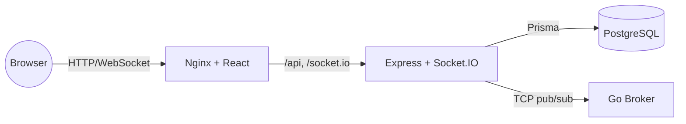

# Broadcast Application

Event-driven pub/sub platform for topics and posts, with real-time updates over WebSocket.

- **Frontend** — React + TypeScript + Tailwind, served by Nginx
- **Backend** — Express + TypeScript API with Socket.IO, Prisma ORM
- **Middleware** — a custom pub/sub message broker written in Go, with peer-to-peer mesh support
- **Database** — PostgreSQL



Backend and frontend communicate over REST for CRUD and Socket.IO for live updates. The backend
publishes `topic_created`/`post_created` events to the Go middleware, which fans them out to every
subscribed backend instance, which then re-broadcasts to connected browsers over WebSocket.

## Local development

Requires Docker and Docker Compose.

```bash
cp .env.example .env
docker compose up --build
```

- Frontend: http://localhost
- Backend API: http://localhost:3000/api
- Middleware broker: localhost:9000 (clients), localhost:9100 (peer mesh)

Running services without Docker (useful while iterating on one piece) is documented in each
service's own README: [backend](backend/README.md), [frontend](frontend/README.md),
[middleware](middleware/README.md).

## Deploying

See [DEPLOY_RAILWAY.md](DEPLOY_RAILWAY.md) for a step-by-step guide to deploying this stack on
Railway so it's reachable from anywhere.

## Further reading

- [Architecture & lifecycle](ARQUITECTURA_E_LIFECYCLE.md)
- [Middleware protocol & mesh design](middleware/README.md)
- [Backend API reference](backend/API_DOCUMENTATION.md)
